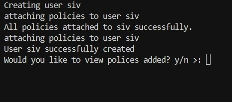
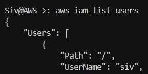
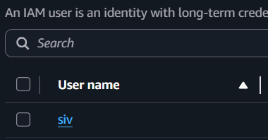
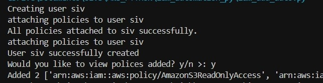
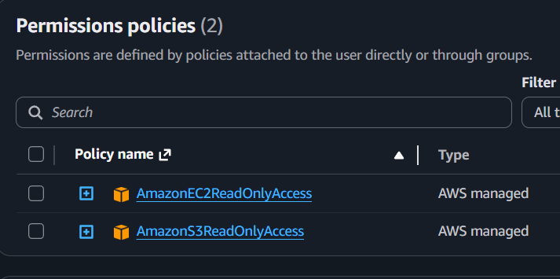
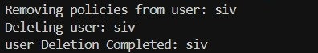

AWS IAM Automation – Python & Boto3
--

This repository demonstrates hands-on experience automating AWS Identity and Access Management (IAM) tasks using Python and boto3. The scripts showcase my ability to create, manage, and remove IAM users programmatically, applying real-world AWS best practices for security, automation, and policy management.

About This Project
---


Managing IAM users manually through the AWS Console can be repetitive and error-prone. These scripts automate the process, giving precise control over user creation, policy assignment, and user deletion. This reflects my focus on:

AWS Core Services: IAM, S3, EC2

Automation Skills: Python scripting for cloud operations

Security Awareness: Detaching policies before user deletion, following least-privilege principles

Practical AWS Learning: Hands-on implementation of AWS best practices

# File 1
```
 1. iam_add_auto.py
```
Automates the creation of an IAM user and attaches predefined AWS managed policies.


# Check if user exists
```
aws iam list-users
```



# Confirm in AWSCONSOLE if user is there




# Key Features:

Creates a user dynamically via Python variable

Attaches multiple AWS managed policies for S3 and EC2 read-only access

# Optionally lists attached policies for verification



Confirm in AWSCONSOLE if policies were added




# File 2
```
2. iam_del_auto.py
```
Automates the safe removal of an IAM user by first detaching policies, preventing errors during deletion.



Create a prompt to confirm deletion for safety.

Key Features:
--

Detaches all assigned policies before deletion

Deletes IAM users programmatically

Optional output of removed policies


Skills Demonstrated
--
AWS Automation: Using boto3 to interact with IAM programmatically

Python Scripting: Writing reusable, readable, and modular automation scripts

Security Mindset: Ensuring policies are detached before deletion, avoiding destructive errors

Cloud Engineering Fundamentals: Hands-on experience with AWS IAM, S3, and EC2 concepts

# Prerequisites
```
Python 3.x

boto3 installed (pip install boto3)

AWS CLI configured with credentials that have sufficient IAM permissions (aws configure)

Required IAM Permissions:

iam:CreateUser

iam:AttachUserPolicy

iam:DetachUserPolicy

iam:DeleteUser
```

Best Practices
---

Use the iam_del_auto with caution as it does not prompt

Test in a sandbox or non-production account before production usage

Follow the principle of least privilege for IAM operations


This project is part of my continuous learning path toward AWS proficiency, combining Python automation, cloud security, and hands-on AWS management skills.
